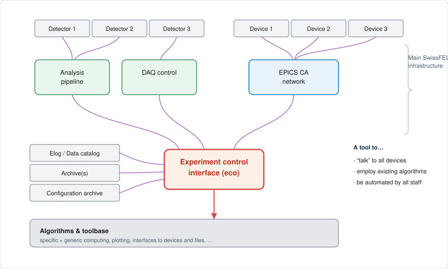
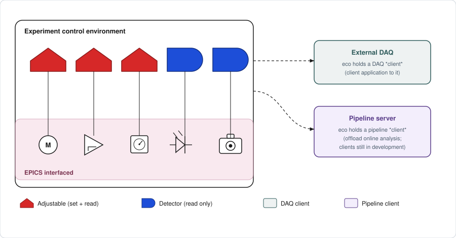
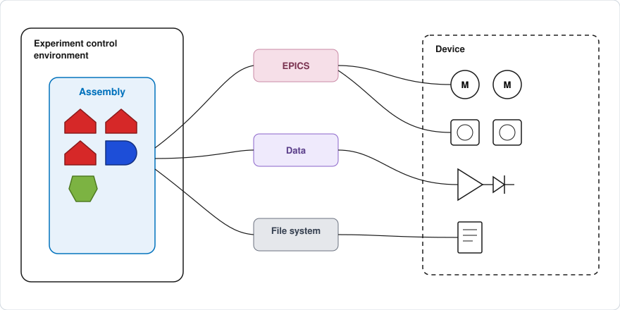

# Concepts

<!-- Diagrams are plain, hand-editable SVGs in docs/images/. -->

**eco is a communication and control tool: the same code that drives a device
interactively also runs unattended in automated routines.** This page builds up
the small vocabulary of elements eco is made of — each one introduced through
the smallest example you can actually run — before combining them into real
devices.

## Why an experiment control interface?

A single experiment touches many systems that speak in different ways: not
only EPICS channel access, but a DAQ, an analysis pipeline, the electronic
logbook, data catalogue, archivers and a configuration store. An experiment
has to set devices, collect data feedback, and run algorithms across all of
them.

**Example — SwissFEL.** The diagram below is SwissFEL's instance of this
problem; the systems named are specific to this facility, but the shape of the
problem is general.



**Objectives** for a tool that solves this:

- **talk to all the devices**, whatever protocol they use;
- **employ existing algorithms** (the scientific Python ecosystem); and
- **be used and automated by the majority of staff**, not just experts.

eco is that tool.

## Definition

eco is three things at once:

1. a **software library of basic elements** used to structure devices and their
   communication;
2. a way to **combine control communication with functional algorithms**; and
3. a **collection of convenience tools** for interactive usage.

eco is implemented in Python: a language that is simple to learn, ubiquitous in
the scientific community, backed by a large base of interfaceable libraries,
and (mostly) free of licence costs.

## The basic elements

eco is built from a small vocabulary. There are just **two local element
types** — the leaves you read and drive — plus **client objects** that stand in
for the external systems eco talks to.



Adjustable
: something you can **set** (and read back) — e.g. a motor.

Detector
: something you can only **read** — e.g. an intensity diode.

The two external systems are represented locally as *clients*, not as
first-class elements:

DAQ client
: eco's client application to the external DAQ.

Pipeline client
: eco's client to the pipeline server, for online analysis. This client is
  still under development — see {doc}`examples/pipeline_offload`.

There is deliberately no separate "scan engine" element. A scan is not a
distinct kind of object in eco; it is an acquisition routine, written in
ordinary Python, that drives Adjustables and reads Detectors in a loop. The
basic elements above are all a scan needs.

This composability rests on **structural typing** (informally, "duck typing"):
an object **is** an Adjustable or a Detector purely by *having the right
method*, not by inheriting from a particular base class. eco expresses this
formally as a `typing.Protocol`
({py:class}`~eco.elements.protocols.Adjustable` /
{py:class}`~eco.elements.protocols.Detector`), so membership can even be
checked with a plain `isinstance()` — no inheritance required, as the examples
below show.

### A Detector

A Detector is anything with a `get_current_value()`. So any zero-argument
"get me the current value of something" function already behaves like one — for
instance the built-in clock:

```python
import time
time.time()          # -> 1774719387.2182806
```

eco's {py:class}`~eco.elements.detector.DetectorGet` turns such a function into
a proper Detector:

```python
from eco.elements.detector import DetectorGet

d = DetectorGet(time.time)
d.get_current_value()   # -> the current time, now via the eco Detector interface
```

That is the whole idea: `DetectorGet` wraps a *get* function.

A class can just as well provide `get_current_value` itself, with no wrapping
at all:

```python
from eco.elements.protocols import Detector

class MyDetector:
    def get_current_value(self):
        return 42

isinstance(MyDetector(), Detector)   # -> True
```

`MyDetector` never imports eco and does not inherit from `Detector` — yet
`isinstance()` confirms it already satisfies the protocol. This is what
"having the right method" means, concretely.

### An Adjustable

An Adjustable is a Detector that can additionally be **set**: it has both
`get_current_value()` and `set_target_value()`. So you supply *two* functions —
one to read, one to write:

```python
state = 5

def get_state():
    return state

def set_state(value):
    global state
    state = value

from eco.elements.adjustable import AdjustableGetSet

a = AdjustableGetSet(get_state, set_state)
a.get_current_value()     # -> 5
a.set_target_value(99)
a.get_current_value()     # -> 99
```

Real devices replace `get_state`/`set_state` with EPICS reads/writes, motion
commands, file access, and so on — but the *interface the rest of eco sees*
stays exactly this small.

The same works with a class that defines both methods directly:

```python
from eco.elements.protocols import Adjustable

class MyAdjustable:
    def get_current_value(self):
        return self._value

    def set_target_value(self, value):
        self._value = value

isinstance(MyAdjustable(), Adjustable)   # -> True
```

:::{admonition} A cleaner variant, without the module global
:class: tip
The `AdjustableGetSet` example above uses a module-level `global state`, which
is easy to follow but is the kind of pattern real code usually avoids. An
equivalent that keeps its state tidily encapsulated:

```python
class _Store:
    value = 5

a = AdjustableGetSet(lambda: _Store.value,
                     lambda v: setattr(_Store, "value", v))
```

Both are legitimate — the closure/attribute form just avoids a module global.
:::

## Representing real devices — the Assembly

A real device is rarely a single value. A diffractometer has many motors; a
detector arm mixes motion, readback and files. eco represents such a device as
an **Assembly**: one named object that bundles Adjustables, Detectors (and other
Assemblies) together, reaching the hardware through whatever mix of interfaces
it needs — EPICS, a live data stream, the file system.



You build an Assembly by *appending* sub-objects to it, each with a name and a
couple of flags:

```python
from eco.elements.assembly import Assembly

class SampleStage(Assembly):
    def __init__(self, name=None):
        super().__init__(name=name)
        self._append(Motor, "SARES:MOT_X", name="x", is_setting=True, is_status=True)
        self._append(Motor, "SARES:MOT_Y", name="y", is_setting=True, is_status=True)
```

`is_setting=True`
: the child is a *setting* of the assembly — it shows up in `.settings()` and is
  captured when settings are saved.

`is_status=True`
: the child contributes to the assembly's `.status()` and its shell
  representation. (For a sub-assembly whose settings should be shown, use
  `is_display='recursive'`.)

Because assemblies nest, a whole instrument is just a tree of these objects, and
every node shares the same handful of methods:

```python
stage.x.mv(2.5)      # move the x motor to 2.5 and wait
stage.x.wm()         # where is it now?
stage.status()       # formatted status of the assembly
stage.get_tree()     # print the object tree
```

## Bernina: a whole instrument as a lazy Namespace

The Bernina instrument is itself an Assembly — specifically a **Namespace**, a
*lazy* Assembly whose components are only initialised when you actually
call/touch them. That keeps startup fast and tolerates components that happen to
be broken or absent on a given day.

```python
from eco.bernina import bernina
```

Inspect what is available:

```python
bernina.namespace.all_names        # every known component
bernina.namespace.lazy_names       # known but not yet initialised
bernina.namespace.required_names   # the ones marked as needed
```

Every Assembly — Bernina or any sub-component — answers the same general
commands:

```python
bernina.get_tree(level=-1)   # full component tree
bernina.status()             # formatted status
```

Because some components are optional (and sometimes not working), you select the
subset you actually need with:

```python
bernina.namespace.select_required_names()
```

(pipeline-offload)=
## Offloading calculations to the pipeline server

The pipeline server can run **user-supplied Python code** on a stream close to
the source — so heavy per-shot calculations on beam-synchronous (BS) data can be
*offloaded* off the analysis client and onto the server. The `cam_server`
pipeline client supports this: you upload a small processing script and attach it
to a running pipeline instance, which then hot-reloads and runs your function on
every message.

A processing script implements one of two contracts, depending on the pipeline
type:

```python
# "processing" pipeline (camera image + optional BS data):
def process_image(image, pulse_id, timestamp, x_axis, y_axis, parameters, bsdata=None):
    return {"my_result": float(image.sum())}

# "custom" pipeline (arbitrary streaming source, e.g. BS channels):
def process(parameters, init=False):
    stream_data = {"my_result": 42.0}
    return stream_data, timestamp, pulse_id, data_size
```

eco is growing a dedicated, still-separate module to make this ergonomic —
uploading a local Python function straight from the shell, managing server-side
scripts, and wiring them onto pipeline instances. This is early/experimental;
the module lives apart from the main device tree for now.

## Where to go next

- {doc}`examples/listening_monitor` — subscribe to a channel and collect its
  values in the background (a *push* stream, complementing the *poll*-style
  Detector above).
- {doc}`examples/archiver_stripchart` — pull historical data from the archiver
  and open a live strip chart.
- {doc}`examples/pipeline_offload` — upload your own code to the pipeline
  server, continuing the section above.
