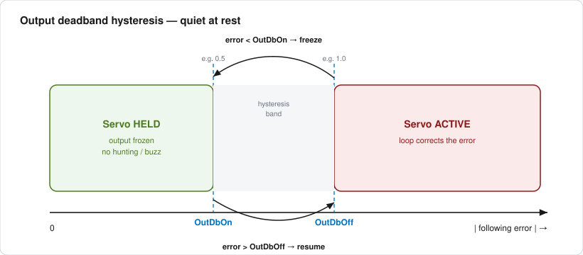
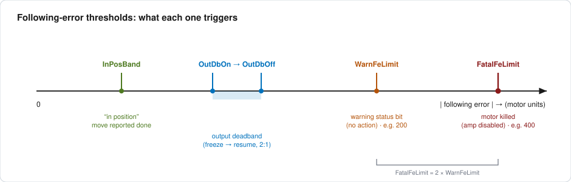

# PowerBrick motors in servo mode

The bernina PowerBrick (Delta Tau / Omron Power PMAC) controllers run their axes
as **closed-loop servos**: a PID-plus-feedforward loop drives each motor so that
its *actual* encoder position tracks the *commanded* position. The
{py:mod}`eco.motion.deltatau_config` configs set this loop up through a handful of
friendly template arguments (`servoSf`, `dirCur`, `InPosBand`, …) that expand into
the raw `Motor[x].*` controller variables.

This page explains the parameters those configs actually use, the ratios the
templates assign between them, and where it is worth re-tuning.

:::{note}
The `gpasciiCommander` templates that turned `!motor(...)` into individual
`Motor[x].*` assignments are **no longer shipped on the beamline**. The mappings
and ratios below are reconstructed from (a) the surviving expanded configs — e.g.
`H2O/cfg/*.cfg`, which write the `Servo.*` variables out explicitly — and (b) the
authoritative Omron manuals. Treat the *exact* arithmetic and units as
"see the Software Reference Manual"; treat the *conventions* as what bernina has
been running.
:::

## Authoritative sources

- **Power PMAC Software Reference Manual (SRM)** — the definitive, per-variable
  reference for every `Motor[x].*` and `Motor[x].Servo.*` element (units, range,
  behaviour). Omron doc **O015**:
  [O015 SRM (Omron EU)](https://files.omron.eu/downloads/latest/manual/en/o015_software_reference_manual_technical_manual_en.pdf) ·
  [O015-E-19 (Omron TW mirror)](https://www.omron.com.tw/data_pdf/mnu/o015-e-19_power_pmac_software.pdf?id=3725)
- **Power PMAC User's Manual** — the conceptual manual: servo-loop block diagram,
  feedforward, filters, and the *Servo Loop Setup / tuning* chapters. Omron doc
  **O014**:
  [O014 User's Manual (Omron EU)](https://files.omron.eu/downloads/latest/manual/en/o014_power_pmac_users_manual_en.pdf)
- **Power PMAC IDE** — its interactive *Tuning* tool (auto-tune + step/parabolic
  move analysis) is the practical way to set the gains discussed below; the IDE
  help embeds the same manual text.
- Community Q&A: the [Omron Automation forums (Power PMAC)](https://forums.automation.omron.com/forum/26-power-pmac/).

## The servo loop in one paragraph

Each servo cycle the controller computes the **following error** = (commanded −
actual) position, in *motor units*. It multiplies that error by the proportional
gain `Kp`, adds an integrated term (`Ki`) and a derivative/velocity term, and adds
**feedforward** (`Kvff` for velocity, `Kaff` for acceleration) predicted from the
trajectory. The sum is the command sent to the amplifier. Good tuning makes the
axis stiff and accurate while moving, and quiet (no buzz/dither) at rest — the two
goals the deadband and gain parameters below trade off.


*Simplified after the servo-loop block diagram in the Power PMAC User's Manual
(O014), reduced to the elements the bernina configs set. The full diagram — with
the notch/low-pass filters and the separate velocity loop — is in O014's
"Servo Loop" chapter and the per-gain definitions are in the SRM (O015).*

## Parameters used in the bernina configs

### Scaling — connect encoder counts and motor micro-steps to user units

| Template arg | Controller effect | Meaning |
|---|---|---|
| `posSf` | encoder table / `Motor[x].PosSf` | **Position scale**: user units per encoder step (e.g. `1./10` = 1 µm per 10 counts). Makes the motor *report* in mm/deg. |
| `servoSf` | servo output scaling | **Servo scale**: motor micro-steps per user unit (e.g. `1024./5`). Makes a *commanded* user-unit move produce the right output. |
| `Sf`, `pos2Sf` | encoder table terms | Additional first/second-order encoder-table scale factors. |
| `enc`, `tbl`, `numBits` | `EncTable[]` setup | Encoder channel, encoder-table index, and (BiSS/SSI) bit count for absolute encoders. |

`posSf` and `servoSf` are **two views of the same mechanical ratio** and must stay
consistent (see [Ratios](#automatically-assigned-ratios) below).

### Motion — trajectory limits

| Template arg | Controller variable | Meaning |
|---|---|---|
| `JogSpeed` | `Motor[x].JogSpeed` | Jog speed, user units per ms. |
| `JogTa` | `Motor[x].JogTa` | Jog accel time (positive = ms; **negative = accel *rate*** in units/ms², the Power PMAC convention seen as `JogTa=-100`). |
| `JogTs` | `Motor[x].JogTs` | Jog S-curve (jerk) time. |
| `AbortTa` | `Motor[x].AbortTa` | Deceleration used on abort/limit. |
| `HomeOffset` | `Motor[x].HomeOffset` | Position offset applied after homing (absolute-encoder zero). |
| `MinPos` / `MaxPos` | soft limits | Software travel limits in user units (`0/0` = disabled). |
| `invDir` | direction sense | Invert the commanded/feedback direction. |

### Current — torque and heat

| Template arg | Controller effect | Meaning |
|---|---|---|
| `dirCur` / `current` | commanded current (`Motor[x].IdCmd` / amp current) | Drive current while moving. Higher = more torque but more heat/dither. |
| `holding_current(mN=[idle, move])` | idle vs. moving current | Drops each motor to a **reduced holding current when idle** and full current while moving — e.g. `m1=[0,500]` means 0 idle / 500 moving. Saves heat and kills at-rest buzzing on stages that hold by friction/brake. |
| `IpfGain`, `IpbGain`, `IiGain` | current/servo-loop gains | Template gain arguments (seen only on the THz BiSS axes); consult the SRM before changing. |

### Servo & deadband — stiffness vs. quiet-at-rest

| Variable | Meaning |
|---|---|
| `Motor[x].Servo.Kp` | Proportional (position) gain — loop stiffness. |
| `Motor[x].Servo.Ki` | Integral gain — removes steady-state error (e.g. against gravity/friction). |
| `Motor[x].Servo.Kvff` | Velocity feedforward — cancels the velocity-proportional following error during a move (important for smooth scans). |
| `Motor[x].Servo.Kaff` | Acceleration feedforward — cancels the accel-proportional error at move start/stop. |
| `Motor[x].Servo.MaxPosErr` | Saturation of the position error fed into the loop — bounds the effect of a large error (anti-windup). |
| `Motor[x].Servo.OutDbOn` | **Output deadband ON threshold**: when the following-error magnitude falls *below* this, the servo output stops updating (holds), so the motor stops hunting and dithering at rest. |
| `Motor[x].Servo.OutDbOff` | **Output deadband OFF threshold**: when the error rises *above* this, the servo resumes active correction. `OutDbOff > OutDbOn` gives hysteresis so it doesn't chatter around one threshold. `OutDbOn = 0` disables the feature. |
| `Motor[x].Servo.BreakPosErr` | Position-error breakpoint for the companion deadband/gain-break behaviour; `0` in all bernina configs (disabled). |



*Behaviour of `Motor[x].Servo.OutDbOn` / `OutDbOff` per the Power PMAC Software
Reference Manual (O015). Example values are the bernina convention
`OutDbOff = 2 × OutDbOn`.*

### Following-error & in-position — safety and "move done"

| Variable | Meaning |
|---|---|
| `Motor[x].WarnFeLimit` | Warning following-error limit: sets a status **warning bit** (no action) — an early "something is dragging" signal. |
| `Motor[x].FatalFeLimit` | Fatal following-error limit: if exceeded, the motor is **killed** (amplifier disabled). The primary protection against a jammed/mis-scaled axis driving into a hard stop. |
| `Motor[x].InPosBand` | In-position band: the axis reports **in-position** once the following error is within this band (with velocity ~zero). Higher-level "is the move finished?" logic keys off this. |

The four thresholds live on the *same* following-error axis, tightest to widest —
which is the easiest way to see how they relate:



*Ordering and effects per the Power PMAC Software Reference Manual (O015); example
numbers are the bernina H2O configs.*

## Automatically assigned ratios

The templates (and the surviving expanded configs) fix a few parameters as fixed
*ratios* of others rather than as independent numbers. These are the conventions
worth preserving:

1. **Deadband hysteresis `OutDbOff = 2 × OutDbOn`.**
   Every expanded H2O axis writes `OutDbOn=.5; OutDbOff=1`. The 2:1 gap is the
   hysteresis that stops the servo chattering in and out of the deadband. Keep
   `OutDbOff` at roughly twice `OutDbOn` when you change either.

2. **Following-error `FatalFeLimit = 2 × WarnFeLimit`.**
   H2O uses `WarnFeLimit=200`, `FatalFeLimit=400`. Warn at half of fatal gives an
   early warning bit before the axis is killed.

3. **`servoSf` and `posSf` are reciprocal views of one mechanical ratio.**
   From the config comments, for a stage where `1024000` micro-steps =
   `50000` encoder counts = `5000` µm:
   `posSf = user/enc = 5000/50000 = 1/10` and
   `servoSf = µsteps/user = 1024000/5000 = 1024/5`.
   Change the mechanics (gearing, encoder, lead) and **both** must be recomputed
   together, or commanded moves and reported positions disagree.

4. **Holding current `[idle, move]`** — idle current is set as a fraction of (often
   zero relative to) the moving current per axis, so a stage draws full torque only
   while slewing.

Because the template that enforced these is gone, the safe place to keep the
conventions now is the {py:mod}`eco.motion.deltatau_config` config files
themselves, with {py:func}`~eco.motion.deltatau_config.check` guarding against
drift.

## Recommendable adjustments — why and how

These are safe, high-value knobs, ordered by payoff. **Always** capture the
current values first (`read_live(host)`), change one axis, and verify — a wrong
value here can drive a motor into a stop.

**1. Silence at-rest buzz with the output deadband — *why*: a stiff loop hunts by
±1 count around the target, which vibrates the sample and heats the motor.
*How*: set `OutDbOn` to just above the encoder noise floor (≈ the peak-to-peak
jitter you see at rest) and `OutDbOff = 2 × OutDbOn`. The THz axis 1 does exactly
this by hand (`Motor[1].Servo.OutDbOff=10`, `InPosBand=5`) because its BiSS
resolution made the template's `.025`/`.5` values far too tight.**

**2. Make `InPosBand` match reality — *why*: if it is tighter than the axis can
hold, "move done" never asserts and scans stall; too loose and you trigger
acquisition before the axis has settled. *How*: derive it from `posSf` — a couple
of encoder counts, or the scientific positioning tolerance, whichever is larger —
rather than copying a number between stages with different resolution. The THz
override (`0.025 → 5`) is a symptom of a value carried across mismatched encoder
scales.**

**3. Set the following-error limits deliberately — *why*: `FatalFeLimit` is the
main protection against a jam or a scaling mistake; left too large it protects
nothing, too small it nuisance-kills during fast moves. *How*: measure the peak
following error during your fastest normal move, set `FatalFeLimit` to ~2–3× that,
and `WarnFeLimit` to half of fatal (keeping ratio #2).**

**4. Turn on feedforward for scanning — *why*: with only `Kp`/`Ki`, a moving axis
lags by an error proportional to speed, so a constant-velocity scan sits off-target
the whole way. *How*: use the Power PMAC IDE tuning tool to set `Kvff` (and `Kaff`)
so the modelled following error during a move drops toward zero; this is the single
biggest win for scan fidelity and is safer than raising `Kp`.**

**5. Use holding current on stages that can hold without it — *why*: full current
at rest is wasted heat (thermal drift of the sample) and a dither source. *How*:
`holding_current(mN=[idle, move])` with a small or zero idle value on axes with
brakes or enough friction; leave gravity-loaded axes at full current.**

**6. Prefer IDE auto-tune over hand-editing `Kp`/`Ki` — *why*: the gains interact,
and raising `Kp` for stiffness without matching damping invites the very
oscillation the deadband then has to mask. *How*: auto-tune to a stable baseline,
then trim, and record the result in the config so
{py:func}`~eco.motion.deltatau_config.check` can flag later drift.**

A good workflow overall: **auto-tune → set feedforward → size the fatal/warn limits
from the observed error → tighten the deadband and `InPosBand` last**, then commit
the values as a named config so they are reproducible and checkable.

## Related

- {doc}`examples/deltatau_config` — read/edit/apply/verify these configs from eco.

## Sources

- [Power PMAC Software Reference Manual (O015), Omron](https://files.omron.eu/downloads/latest/manual/en/o015_software_reference_manual_technical_manual_en.pdf)
- [Power PMAC User's Manual (O014), Omron](https://files.omron.eu/downloads/latest/manual/en/o014_power_pmac_users_manual_en.pdf)
- [O015-E-19 Power PMAC Software Reference Manual (mirror)](https://www.omron.com.tw/data_pdf/mnu/o015-e-19_power_pmac_software.pdf?id=3725)
- [Omron Automation forums — Power PMAC](https://forums.automation.omron.com/forum/26-power-pmac/)
```
