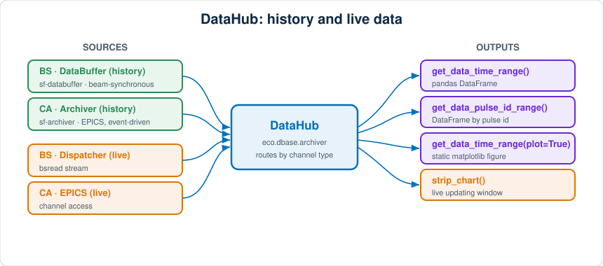

# Archiver data and strip charts

A {py:class}`~eco.dbase.archiver.DataHub` gives you access to both **historical**
channel data (from the SwissFEL archivers) and **live** channel data (as a
DataFrame snapshot or a continuously updating strip chart). It is built on the
PSI `datahub` package and understands the two channel conventions used
throughout eco:

- **BS** — beam-synchronous data from the DataBuffer (`sf-databuffer`), fast and
  effectively continuous.
- **CA** — EPICS Archiver Appliance data (`sf-archiver`), event-driven (a point
  is stored when the channel changes).



## Creating a DataHub

```python
from eco.dbase.archiver import DataHub

# `pv_pulse_id` is the PV that reports the current pulse id; it enables the
# pulse-id based queries further down. It is optional for time-range queries.
archiver = DataHub(pv_pulse_id="SLAAR11-LTIM01-EVR0:RX-PULSEID")
```

At the beamline a ready-made instance is usually reachable from the instrument
object (e.g. as `bernina.archiver` / via `ecocnf.archiver`), so you rarely have
to construct one yourself.

## Getting historical data from the archiver

`get_data_time_range` is the workhorse. Give it channels and a time window; the
window can be expressed in several convenient ways.

```python
# The last hour of a channel, as a pandas DataFrame indexed by UTC timestamp:
df = archiver.get_data_time_range(
    channels=["SARFE10-PBPG050:HAMP-INTENSITY-CAL"],
    hours=1,
)

# An explicit window (ISO strings or datetimes both work):
df = archiver.get_data_time_range(
    channels=["SARFE10-PBPG050:HAMP-INTENSITY-CAL"],
    start="2026-08-10 08:00",
    end="2026-08-10 09:00",
)

# Relative starts: a number of seconds, a timedelta, or a dict of timedelta
# kwargs — all relative to `end` (which defaults to now):
df = archiver.get_data_time_range(channels=[chan], start=-1800)          # last 30 min
df = archiver.get_data_time_range(channels=[chan], start={"minutes": 30})
```

Useful options:

- `force_type="CA"` (or `"BS"`) selects the backend for *all* channels; by
  default BS is assumed. Pass `channel_types=[...]` to specify the type of each
  channel individually.
- `convert_timezone=True` converts the index from UTC to `Europe/Zurich`.
- `labels=[...]` sets nicer legend labels for the plot.

### Finding channel names

If you are not sure of the exact channel name, search with a glob pattern:

```python
archiver.search("*PBPG050*INTENSITY*")            # all backends
archiver.search("*ARES*", backend="sf-databuffer")  # BS only
```

### By pulse id

For beam-synchronous channels you can query a pulse-id range instead. With no
`end`, it uses the current pulse id and treats `start` as an offset:

```python
# The last 1000 pulses of a BS channel:
df = archiver.get_data_pulse_id_range(channels=[chan], start=-1000)
```

## Getting archiver data into a plot

Every retrieval method takes `plot=True`, which draws the returned DataFrame as
a stepped time series on a fresh matplotlib figure:

```python
archiver.get_data_time_range(
    channels=[
        "SARFE10-PBPG050:HAMP-INTENSITY-CAL",
        "SARFE10-PBIG050-EVR0:CALCI",
    ],
    hours=2,
    labels=["gas monitor", "beam current"],
    plot=True,
)
```

Since you also get the DataFrame back, you can just as easily plot or analyse it
yourself with pandas/matplotlib.

## A live strip chart

`strip_chart` opens a **continuously updating** window fed straight from the
live source — the bsread Dispatcher for BS channels (default) or EPICS for CA
channels. It returns a handle so you can stop it later:

```python
sc = archiver.strip_chart(
    channels=[
        "SARFE10-PBPG050:HAMP-INTENSITY-CAL",
        "SARFE10-PBIG050-EVR0:CALCI",
    ],
)

# ... watch it update live ...

sc.stop()          # end the chart (or simply close the plot window)
sc.is_running()    # -> False once stopped
```

For a fixed-duration capture rather than an open-ended chart, use
`get_live_data(channels=[...], duration=10)`, which records a set number of
seconds and hands you back a DataFrame (optionally `plot=True`).

:::{note}
Retrieving **CA** historical data needs the `cbor2` package installed
(`pip install cbor2`); without it, queries on channels that have no associated
pulse id can fail. BS retrieval does not need it.
:::

## Related

- {doc}`listening_monitor` — for capturing a channel's *future* updates from
  within Python, rather than querying stored history.
