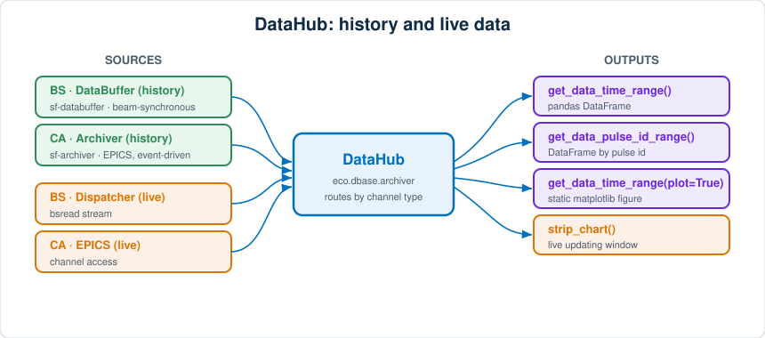

# Archiver data and strip charts

A {py:class}`~eco.dbase.archiver.DataHub` gives you access to both **historical**
channel data (from the SwissFEL archivers) and **live** channel data (as a
DataFrame snapshot or a continuously updating strip chart). It is built on the
PSI `datahub` package and understands the two channel conventions used
throughout eco:

- **BS** — beam-synchronous data from the DataBuffer (`sf-databuffer`), fast and
  effectively continuous.
- **CA** — EPICS Archiver Appliance data (`sf-archiver`), event-driven (a point
  is stored when the channel changes).



## Creating a DataHub

```python
from eco.dbase.archiver import DataHub

# `pv_pulse_id` is the PV that reports the current pulse id; it enables the
# pulse-id based queries further down. It is optional for time-range queries.
archiver = DataHub(pv_pulse_id="SLAAR11-LTIM01-EVR0:RX-PULSEID")
```

At the beamline a ready-made instance is usually reachable from the instrument
object (e.g. as `bernina.archiver` / via `ecocnf.archiver`), so you rarely have
to construct one yourself.

## Getting historical data from the archiver

`get_data_time_range` is the workhorse. Give it channels and a time window; the
window can be expressed in several convenient ways.

```python
# The last hour of a channel, as a pandas DataFrame indexed by UTC timestamp:
df = archiver.get_data_time_range(
    channels=["SARFE10-PBPG050:HAMP-INTENSITY-CAL"],
    hours=1,
)

# An explicit window (ISO strings or datetimes both work):
df = archiver.get_data_time_range(
    channels=["SARFE10-PBPG050:HAMP-INTENSITY-CAL"],
    start="2026-08-10 08:00",
    end="2026-08-10 09:00",
)

# Relative starts: a number of seconds, a timedelta, or a dict of timedelta
# kwargs — all counted back from `end` (which defaults to now). Negative reads
# naturally, but the sign is ignored: 1800 and {"minutes": 30} mean the same.
df = archiver.get_data_time_range(channels=[chan], start=-1800)          # last 30 min
df = archiver.get_data_time_range(channels=[chan], start={"minutes": -30})
```

Useful options:

- `force_type="CA"` (or `"BS"`) selects the backend for *all* channels; by
  default BS is assumed. Pass `channel_types=[...]` to specify the type of each
  channel individually.
- `convert_timezone=True` converts the index from UTC to `Europe/Zurich`.
- `labels=[...]` sets nicer legend labels for the plot.

Each call prints the range it actually asked the archiver for (UTC and local)
and, per channel, whether data came back or why not (`verbose=False` silences
this and skips the extra requests below). A CA channel is only stored when it
changes, so a quiet one has no events in a short window. One extra request per
such channel tells you which case you are in:

```
target_stages.x.offset (SARES20-MF2:MOT_1.OFF): no events in range; last before it: 8.3875 (set 2026-10-05 13:03:37 UTC)
target_stages.x.velocity (SARES20-MF2:MOT_1.VELO): not found in sf-archiver (not archived under this name)
```

The first exists and was simply quiet (the value it had is shown); the second
is not archived at all.

### Several eco objects at once

Instead of channel names you can pass eco objects — an Assembly, an adjustable,
a detector. Every archived channel below the object's alias is retrieved.
Objects, plain channel ids and lists of both can be mixed, and a channel that
several objects share is fetched once:

```python
df = archiver.get_data_time_range(prof_kb.target_stages, mon_opt, start=-1e5)

# extra channels: plain ids are read from the DataBuffer (BS) unless you say
# otherwise, either per channel ...
df = archiver.get_data_time_range(
    prof_kb.target_stages,
    channels=["SARES20-MF1:MOT_1.RBV"], channel_types=["CA"],
    start=-3600,
)
# ... or for everything at once with force_type=
```

Objects bring their own channel types and legend labels, so leave `force_type`
unset when passing them. Legend labels carry each channel's full alias
(`prof_kb.target_stages.x.offset (SARES20-MF2:MOT_1.OFF)`). The start (and end)
may also follow the objects positionally if it is a number, timedelta, dict or
datetime — `archiver.get_data_time_range(prof_kb.target_stages, -3600)`; a date
*string* must be passed as `start=`, since it could as well be a channel id.

By default the DataFrame columns are channel ids, in the order you asked.
`column_names="alias"` names them by the full alias instead
(`prof_kb.target_stages.x.offset`), `column_names="label"` by the whole legend
label.

### Long ranges of BS channels: `bins`

A BS channel runs at up to 100 Hz: a day of one channel is 8.6 million
samples, roughly 20 s to fetch. A warning (with that estimate) is printed
whenever a request would be that big. Downsample **on the server** instead:

```python
# a bin count (the server rounds to a sensible bin width) ...
df = archiver.get_data_time_range(gasmon, start=-86400, bins=500)
# ... or a bin width: "10s", "1m", "1h", ...
df = archiver.get_data_time_range(gasmon, start=-86400, bins="10m")
```

Each channel comes as its bin average plus `<channel> min`, `<channel> max` and
`<channel> count` columns, stamped at the bin centre; empty bins are NaN.
`bins` works for CA channels and for `get_data_pulse_id_range` too.

### The value at the start of the window: `last_before`

A quiet CA channel has no events in a short window, and a step plot of it has
no starting value. `last_before=True` also fetches each channel's last event
before the window (the archiver's "one before range") and puts it *at* the
start of the window:

```python
df = archiver.get_data_time_range(prof_kb.target_stages, start=-600, last_before=True)
```

It cannot be combined with `bins`.

### Finding channel names

If you are not sure of the exact channel name, search with a glob pattern:

```python
archiver.search("*PBPG050*INTENSITY*")            # all backends
archiver.search("*ARES*", backend="sf-databuffer")  # BS only
```

### By pulse id

For beam-synchronous channels you can query a pulse-id range instead. With no
`end`, it uses the current pulse id and treats `start` as an offset:

```python
# The last 1000 pulses of a BS channel:
df = archiver.get_data_pulse_id_range(channels=[chan], start=-1000)
```

It takes everything `get_data_time_range` does — eco objects, `bins`,
`last_before`, `column_names` — and positional `start`/`end`:
`archiver.get_data_pulse_id_range(gasmon, 28549932558, 28549938558)`. A negative
`start` is an offset back from `end`. (Pulse ids are mapped to times with the
service's own map; datahub's built-in linear formula was days off.)

## Getting archiver data into a plot

Every retrieval method takes `plot=True`, which draws the returned DataFrame as
a stepped time series on a fresh matplotlib figure:

```python
archiver.get_data_time_range(
    channels=[
        "SARFE10-PBPG050:HAMP-INTENSITY-CAL",
        "SARFE10-PBIG050-EVR0:CALCI",
    ],
    hours=2,
    labels=["gas monitor", "beam current"],
    plot=True,
)
```

With many curves, the figure window's toolbar has a **Select curves** button
(right after *Save*, Qt backends): it opens a window with a checkbox per curve,
a filter box and All/None, and hides or shows curves immediately — the legend
and the y-range follow. The button comes from escape (`escape >= 0.2.14`,
`escape.plot_utilities.attach_select_button`, which also covers the Jupyter
widget backend); with an older escape a built-in Qt-only version is used.

Since you also get the DataFrame back, you can just as easily plot or analyse it
yourself with pandas/matplotlib.

## A live strip chart

`strip_chart` opens a **continuously updating** window fed straight from the
live source — the bsread Dispatcher for BS channels (default) or EPICS for CA
channels. It returns a handle so you can stop it later:

```python
sc = archiver.strip_chart(
    channels=[
        "SARFE10-PBPG050:HAMP-INTENSITY-CAL",
        "SARFE10-PBIG050-EVR0:CALCI",
    ],
)

# ... watch it update live ...

sc.stop()          # end the chart (or simply close the plot window)
sc.is_running()    # -> False once stopped
```

For a fixed-duration capture rather than an open-ended chart, use
`get_live_data(channels=[...], duration=10)`, which records a set number of
seconds and hands you back a DataFrame (optionally `plot=True`).

:::{note}
Retrieving **CA** historical data needs the `cbor2` package installed
(`pip install cbor2`); without it, queries on channels that have no associated
pulse id can fail. BS retrieval does not need it.
:::

## Related

- {doc}`listening_monitor` — for capturing a channel's *future* updates from
  within Python, rather than querying stored history.
