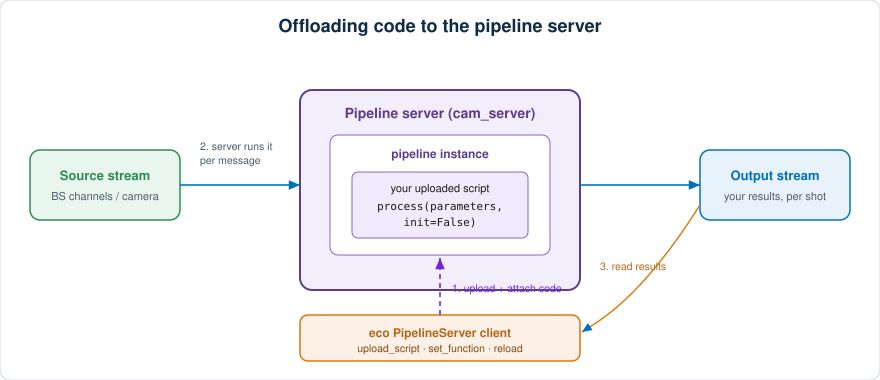

# Offloading code to the pipeline server

Some per-shot calculations are too heavy to run comfortably in an analysis
client — especially on fast beam-synchronous (BS) streams. The **pipeline
server** (`cam_server`) can run *your own Python code* on a stream, right next
to the data source, and publish the results as a new stream. eco's
{py:class}`~eco.pipeline.pipeline_server.PipelineServer` makes that upload
ergonomic.

:::{note}
This module is experimental and kept separate from the main eco device tree.
It wraps the external `cam_server` `PipelineClient`.
:::

## How it works



1. **You upload a small processing script** to the server (from a file, or
   straight from a function in your shell/notebook).
2. **The server hot-reloads it** and runs it on every message of the pipeline
   instance, close to the source — off your client.
3. **Results come back as a new output stream** you can read like any other.

The script must be **self-contained**: it does its own imports at the top,
because the server executes the file on its own.

## The two script contracts

Which function your script defines depends on the pipeline *type*:

`process` — a **custom** pipeline (arbitrary streaming source, e.g. BS channels).
The natural fit for offloading BS-stream calculations:

```python
def process(parameters, init=False):
    # `init` is True on the very first call — set up state once here.
    # `parameters` is the live pipeline config dict.
    stream_data = {"my_result": 42.0}
    timestamp = ...      # seconds since epoch for this message
    pulse_id = ...       # pulse id, or None
    data_size = 1
    return stream_data, timestamp, pulse_id, data_size
```

`process_image` — a **processing** pipeline (camera image, plus optional
synchronous BS data in `bsdata`):

```python
def process_image(image, pulse_id, timestamp, x_axis, y_axis, parameters, bsdata=None):
    return {"my_intensity": float(image.sum())}
```

Each key you return becomes a channel on the output stream.

Ready-to-edit starting points ship with the module:

```python
from eco.pipeline import PROCESS_IMAGE_TEMPLATE, CUSTOM_PROCESS_TEMPLATE
print(CUSTOM_PROCESS_TEMPLATE)   # copy into a .py file and edit
```

## Attaching a script to a running instance

Write a self-contained script to a file, then hand it to an existing pipeline
instance. {py:meth}`~eco.pipeline.pipeline_server.PipelineServer.set_function`
uploads the file *and* tells the instance to reload — so your new code starts
running immediately:

```python
from eco.pipeline import PipelineServer

ps = PipelineServer()
ps.set_function("SARFE10-PSSS059_sp1", "/sf/bernina/.../my_proc.py")
```

Manage what is on the server with the script helpers:

```python
ps.list_scripts()                 # names of user scripts on the server
ps.read_script("my_proc.py")      # fetch a script's source back
ps.delete_script("my_proc.py")
```

## Offloading a function straight from the shell

For a quick, self-contained function you can skip the file and offload it
directly — the source is captured with `inspect.getsource` and uploaded:

```python
def process(parameters, init=False):
    import time
    return {"answer": 42.0}, time.time(), None, 1

ps.offload_function("my_custom_instance", process)
```

The function must be named `process` or `process_image` (to match a contract),
and — since only its body is uploaded — must import everything it needs *inside
itself*. For anything needing module-level imports or helper functions, write a
`.py` file and use `set_function` instead.

## Creating a custom pipeline from scratch

To spin up a new **custom** pipeline driven entirely by your script:

```python
instance_id, stream_address = ps.create_custom_pipeline(
    "/sf/bernina/.../my_stream_proc.py",
    additional_config={
        # e.g. input stream / BS channel wiring goes here
    },
)
```

## Reading the results

The output is a standard pipeline stream; get its address and read it however
you normally consume streams:

```python
ps.stream_address(instance_id)   # e.g. "tcp://…:xxxx"
ps.instance_info(instance_id)    # server-side status
ps.is_running(instance_id)
ps.stop(instance_id)
```

## Related

- {doc}`listening_monitor` — collect a channel's updates in the client instead.
- {doc}`archiver_stripchart` — historical data and live strip charts.
