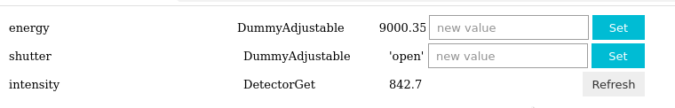

# Adjustable/Detector widget views

Every {py:class}`~eco.elements.protocols.Adjustable` or
{py:class}`~eco.elements.protocols.Detector` in an assembly can be looked at
live from either front end — the Qt desktop workbench or a browser
(JupyterLab/Voila, via ipywidgets). Both build one row per item from the same
underlying `get_current_value()`/`set_target_value()` interface, but they are
two independent implementations with different capabilities, described below.

## Default per-item row

### Qt desktop (`eco.widgets.display_qt`)

The desktop app's dockable property grid ({py:class}`~eco.widgets.display_qt.DisplayQt`,
also used standalone via `make_assembly_qt_window`) shows a **name / current /
control** row per item, polled on a background thread:

- **Detector-only** items are read-only text — no controls.
- **Numeric Adjustables** get a step-size field, ▲/▼ tweak buttons (move
  relative to the *live* current value, not the last-displayed one), an
  absolute-value entry, and 🛑 Stop / ↺ Reset (back to the value from when the
  row was built).
- **Enum-valued Adjustables** (anything exposing `enum_strs`, e.g.
  `AdjustablePvEnum`) get a dropdown instead of step/absolute controls, same
  Stop/Reset pair.
- Right-clicking a name label opens **"Add indicator"** — see below.

### ipywidgets (`eco.widgets.assembly_browser`)

The browser-side namespace/assembly browser used by the `lab`/`voila`
front ends builds each row as a plain ipywidgets `HBox`
({py:class}`~eco.widgets.assembly_browser._ItemWidget`):

- Name, Python type, and `repr()` of the current value are always shown.
- **Adjustables** get a free-text entry plus a **Set** button (best-effort
  type coercion against the current value — bool/int/float/fallback JSON);
  there is no step/tweak concept here, no Stop, and no live polling — value
  updates only on explicit **Refresh** (Detectors) or after a successful
  **Set** (Adjustables).
- **Detectors** get a **Refresh** button only.

This is a simpler, more manual sibling of the Qt row — it works anywhere a
kernel/comm can reach a browser (including Voila, with no desktop Qt
involved) but does not poll live and has no notion of enum dropdowns, tweak
steps, or in-flight move stopping.

## Indicator / gadget widgets (Qt only)

For a LabVIEW-style live panel — LEDs, gauges, dials — instead of a grid row,
`eco.widgets.indicator_widgets` provides small standalone gadgets, one per
item, meant to be pulled out of the property grid and dropped onto a
{py:class}`~eco.widgets.dashboard_qt.Dashboard`:

| Gadget | Read/write | Notes |
|---|---|---|
| `LEDIndicator` | writes (click to toggle) if settable | green/red/gray for on/off/unknown; `threshold=` for "value ≥ X" |
| `BarGauge` | read-only | vertical or horizontal fill against `[vmin, vmax]` |
| `AnalogGauge` | read-only | semicircular needle gauge |
| `StripChart` | read-only | rolling line plot of the last N readings |
| `NumericTile` | read-only | large numeric readout + sparkline (KPI-tile style) |
| `Dial` | writes if settable | continuous rotary knob for plain numerics; a mode-select ring (every enum choice shown at once) when the item exposes `enum_strs` |
| `Slider` | writes if settable | horizontal slider with numeric readout |

No dropdown, text entry, or hidden menu is needed to read a value at a
glance — that's the point of these versus the default grid row. Getting one
onto screen is a right-click away: right-click a parameter's name in the
normal Qt property grid → **Add indicator** → pick a gadget kind (see
`eco.widgets.display_qt`'s `_build_row`, wired via
`eco.widgets.indicator_widgets.attach_indicator_menu`). A gadget is also a
valid Qt Designer "promoted widget", and round-trips through a saved
dashboard layout via the item's alias path.

There is currently **no ipywidgets/browser equivalent** of these gadgets —
they are Qt-only.
